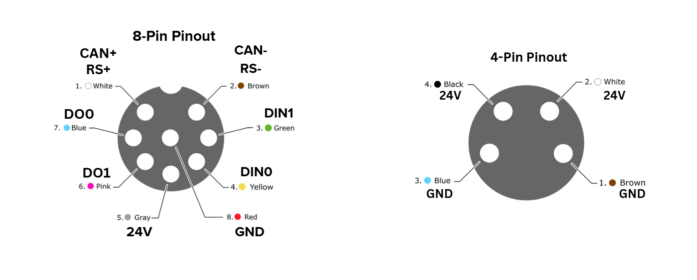

# Quickstart

## 1. Hardware Setup

### ARTUS Lite

Connect power and data using the supplied cables. 
Please see robot's exact documentation pages for specific wiring.

> The diagram above shows the required wiring layout for the Artus Lite hand, including power, ground, and data connections.
> Always reference your hand model’s specific documentation for any model-specific differences before wiring.

Alternatively to the 8-pin connector, you may connect to the ARTUS Lite via USB.

## 2. Software Setup

Navigate to the [artustui repository](https://github.com/Sarcomere-Dynamics/artustui) for further instructions on how to test your ARTUS product.
